---
## Front matter
title: "Отчет по лабораторной работе №6"
subtitle: "дисциплина: Архитектура компьютера"
author: "Белоусова Елизавета Валентиновна"

## Generic otions
lang: ru-RU
toc-title: "Содержание"

## Bibliography
bibliography: bib/cite.bib
csl: pandoc/csl/gost-r-7-0-5-2008-numeric.csl

## Pdf output format
toc: true # Table of contents
toc-depth: 2
lof: true # List of figures
lot: true # List of tables
fontsize: 12pt
linestretch: 1.5
papersize: a4
documentclass: scrreprt
## I18n polyglossia
polyglossia-lang:
  name: russian
  options:
	- spelling=modern
	- babelshorthands=true
polyglossia-otherlangs:
  name: english
## I18n babel
babel-lang: russian
babel-otherlangs: english
## Fonts
mainfont: PT Serif
romanfont: PT Serif
sansfont: PT Sans
monofont: PT Mono
mainfontoptions: Ligatures=TeX
romanfontoptions: Ligatures=TeX
sansfontoptions: Ligatures=TeX,Scale=MatchLowercase
monofontoptions: Scale=MatchLowercase,Scale=0.9
## Biblatex
biblatex: true
biblio-style: "gost-numeric"
biblatexoptions:
  - parentracker=true
  - backend=biber
  - hyperref=auto
  - language=auto
  - autolang=other*
  - citestyle=gost-numeric
## Pandoc-crossref LaTeX customization
figureTitle: "Рис."
tableTitle: "Таблица"
listingTitle: "Листинг"
lofTitle: "Список иллюстраций"
lotTitle: "Список таблиц"
lolTitle: "Листинги"
## Misc options
indent: true
header-includes:
  - \usepackage{indentfirst}
  - \usepackage{float} # keep figures where there are in the text
  - \floatplacement{figure}{H} # keep figures where there are in the text
---

**1 Цель работы**

Цель данной лабораторной работы - освоение арифметческих инструкций
языка ассемблера NASM.

**2 Задание**

1. Символьные и численные данные в NASM
2. Выполнение арифметических операций в NASM
3. Выполнение заданий для самостоятельной работы

**3 Теоретическое введение**

Большинство инструкций на языке ассемблера требуют обработки операндов.
Адрес операнда предоставляет место, где хранятся данные, подлежащие обра-
ботке. Это могут быть данные хранящиеся в регистре или в ячейке памяти. -
Регистровая адресация – операнды хранятся в регистрах и в команде использу-
ются имена этих регистров, например: mov ax,bx. - Непосредственная адресация
– значение операнда задается непосредственно в команде, Например: mov ax,2.
- Адресация памяти – операнд задает адрес в памяти. В команде указывается
символическое обозначение ячейки памяти, над содержимым которой требуется
выполнить операцию.
Ввод информации с клавиатуры и вывод её на экран осуществляется в символь-
ном виде. Кодирование этой информации производится согласно кодовой табли-
це символов ASCII. ASCII – сокращение от American Standard Code for Information
Interchange (Американский стандартный код для обмена информацией). Соглас-
но стандарту ASCII каждый символ кодируется одним байтом. Среди инструкций
NASM нет такой, которая выводит числа (не в символьном виде). Поэтому, на-
пример, чтобы вывести число, надо предварительно преобразовать его цифры в
ASCII-коды этих цифр и выводить на экран эти коды, а не само число. Если же
выводить число на экран непосредственно, то экран воспримет его не как число,
а как последовательность ASCII-символов – каждый байт числа будет воспринят
как один ASCII-символ – и выведет на экран эти символы. Аналогичная ситу-
ация происходит и при вводе данных с клавиатуры. Введенные данные будут
представлять собой символы, что сделает невозможным получение корректного результата при выполнении над ними арифметических операций. Для решения
этой проблемы необходимо проводить преобразование ASCII символов в числа
и обратно. 

**4 Выполнение лабораторной работы**

Перехожу в каталог, созданный для файлов с программами для лабораторной работы №6 (рис. 1).                            
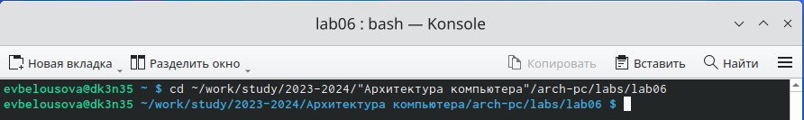                                   
Рис. 1: Перемещение между директориями                           

С помощью утилиты touch создаю файл lab6-1.asm (рис. 2)                         
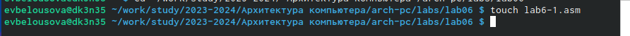                                   
Рис. 2: Создание файла                                  

Копирую в текущий каталог файл in_out.asm с помощью утилиты cp, так как он
будет использоваться в других программах (рис. 3).                             
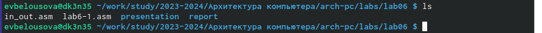                                   
Рис. 3: Создание копии файла                              

Открываю созданный файл lab6-1.asm, вставляю в него программу вывода
значения регистра eax (рис. 4).                          
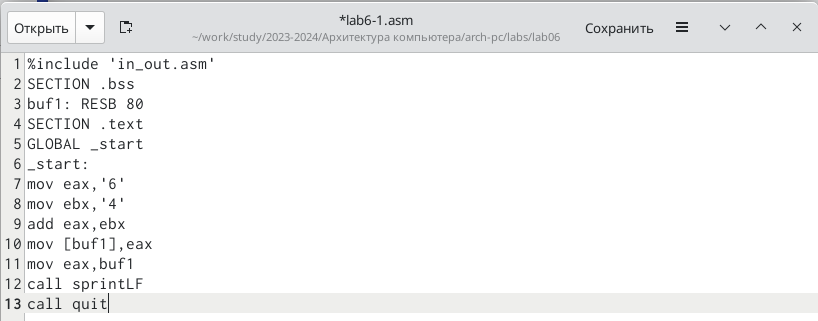                                   
Рис. 4: Редактирование файла                                       

Создаю исполняемый файл программы и запускаю его (рис. 5). Вывод про-
граммы: символ j, потому что программа вывела символ, соответствующий по
системе ASCII сумме двоичных кодов символов 4 и 6.                        
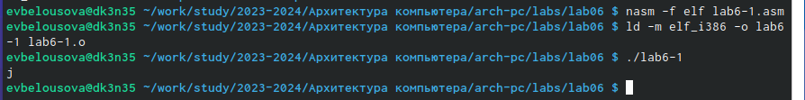                                   
Рис. 5: Запуск исполняемого файла                              

Изменяю в тексте программы символы “6” и “4” на цифры 6 и 4 (рис. 6).                       
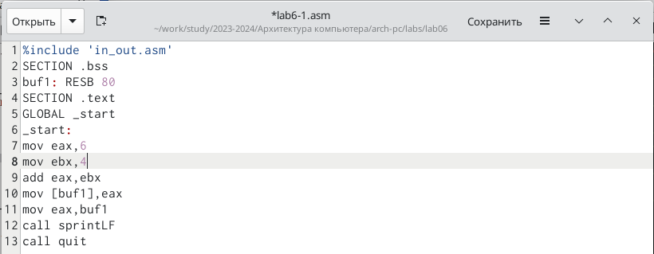                                   
Рис. 6: Редактирование файла                          

Создаю новый исполняемый файл программы и запускаю его (рис. 7). Те-
перь вывелся символ с кодом 10, это символ перевода строки, этот символ не
отображается при выводе на экран.                         
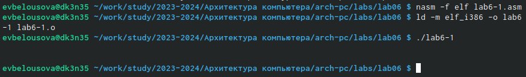                                   
Рис. 7: Запуск исполняемого файла                   

Создаю новый файл lab6-2.asm с помощью утилиты touch (рис. 8).                    
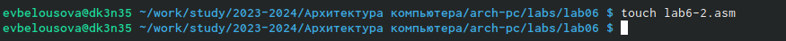                                   
Рис. 8: Создание файла                              

Ввожу в файл текст другойпрограммы для вывода значения регистра eax (рис.
9).                             
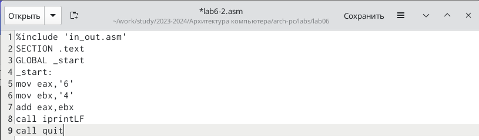                                        
Рис. 9: Редактирование файла                        

Создаю и запускаю исполняемый файл lab6-2 (рис. 10). Теперь вывод число
106, потому что программа позволяет вывести именно число, а не символ, хотя
все еще происходит именно сложение кодов символов “6” и “4”.                    
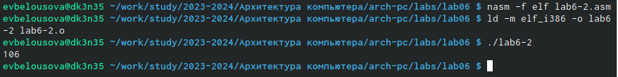                                   
Рис. 10: Запуск исполняемого файла                              

Заменяю в тексте программы в файле lab6-2.asm символы “6” и “4” на числа 6
и 4 (рис. 11).                          
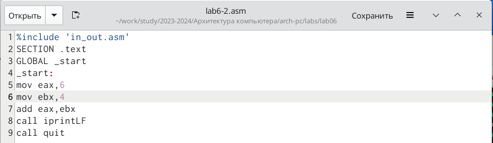                                        
Рис. 11: Редактирование файла                          

Создаю и запускаю новый исполняемый файл (рис. 12). Теперь программа
складывает не соответствующие символам коды в системе ASCII, а сами числа, поэтому вывод 10.                               
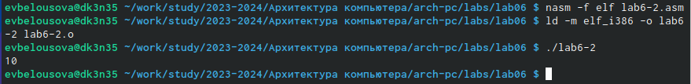                                   
Рис. 12: Запуск исполняемого файла                           

Заменяю в тексте программы функцию iprintLF на iprint (рис. 13).                
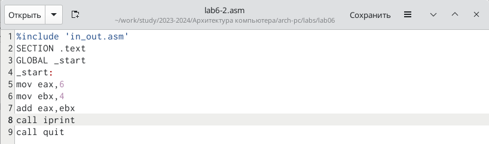                                        
Рис. 13: Редактирование файла                              

Создаю и запускаю новый исполняемый файл (рис. 14). Вывод не изменился,
потому что символ переноса строки не отображался, когда программа исполня-
лась с функцией iprintLF, а iprint не добавляет к выводу символ переноса строки,
в отличие от iprintLF.                        
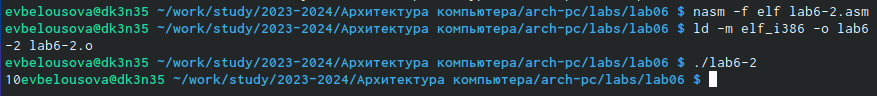                                   
Рис. 14: Запуск исполняемого файла                           

Создаю файл lab6-3.asm с помощью утилиты touch (рис. 15).                  
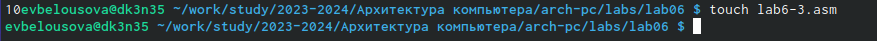                                   
Рис. 15: Создание файла                          

Ввожу в созданный файл текст программы для вычисления значения выраже-
ния f(x) = (5 * 2 + 3)/3 (рис. 16).                        
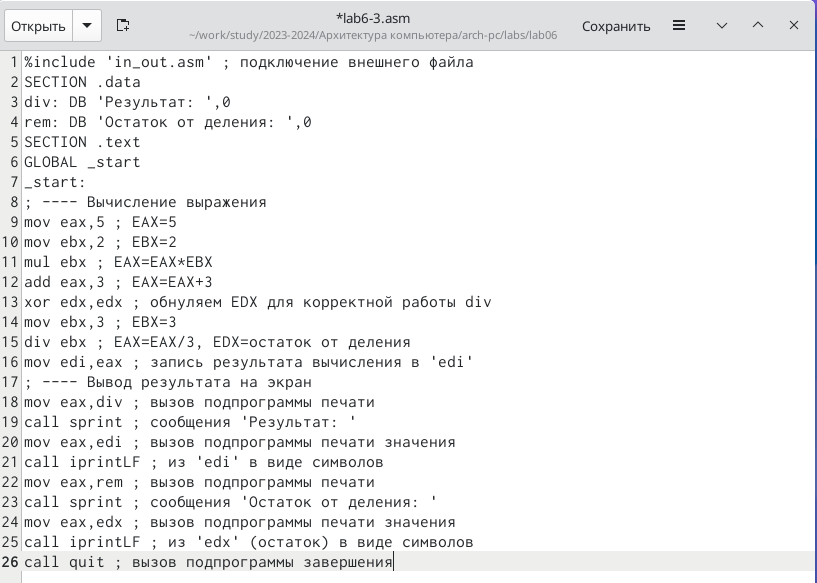                                        
Рис. 16: Редактирование файла                   

Создаю исполняемый файл и запускаю его (рис. 17)                     
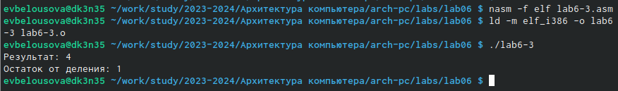                                   
Рис. 17: Запуск исполняемого файла                             

Изменяю программу так, чтобы она вычисляла значение выражения f(x) = (4 *
6 + 2)/5 (рис. 18).                       
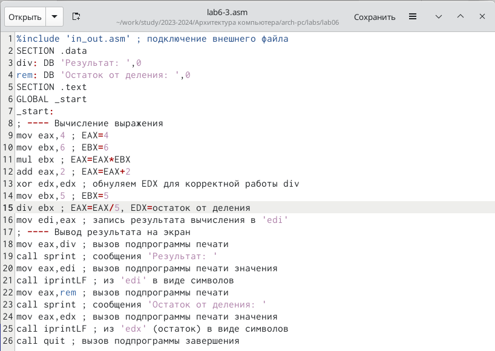                                   
Рис. 18: Изменение текста программы                         

Создаю и запускаю новый исполняемый файл (рис. 19). Я посчитала для про-
верки правильности работы программы значение выражения самостоятельно,
программа отработала верно.                        
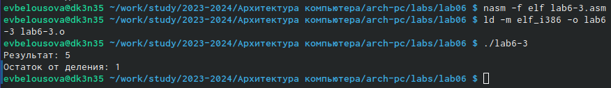                                   
Рис. 19: Запуск исполняемого файла                                        

Создаю файл variant.asm с помощью утилиты touch (рис. 20)                    
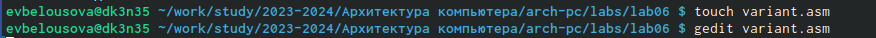                                   
Рис. 20: Создание файла                              

Ввожу в файл текст программы для вычисления варианта задания по номеру
студенческого билета (рис. 21)                              
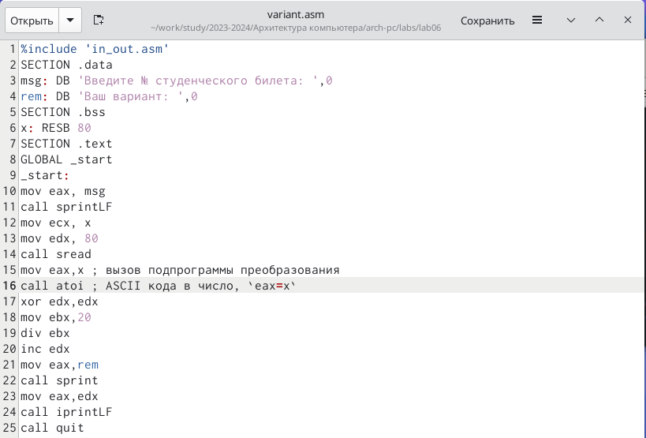                                        
Рис. 21: Редактирование файла                            

Создаю и запускаю исполняемый файл (рис. 22). Ввожу номер своего студенческого
билета с клавиатуры, программа вывела, что мой вариант - 18.                        
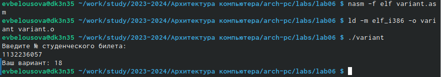                                   
Рис. 22: Запуск исполняемого файла                                 

Создаю файл lab6-4.asm с помощью утилиты touch (рис. 23).                 
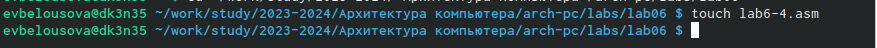                                   
Рис. 23: Создание файла                                 

Открываю созданный файл для редактирования, ввожу в него текст программы
для вычисления значения выражения 3(𝑥 + 10) − 20  (рис. 24). Это выражение
было под вариантом 18.                             
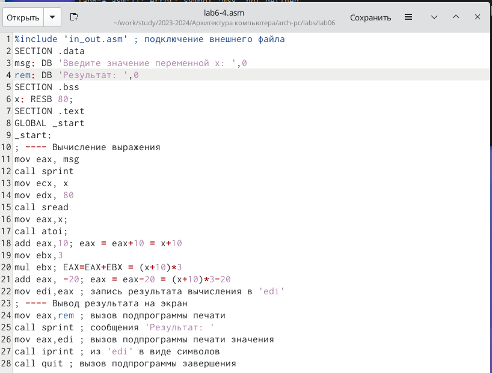                                   
Рис. 24: Написание программы                       

Создаю и запускаю исполняемый файл (рис. 25). При вводе значения 5, вывод - 25.            
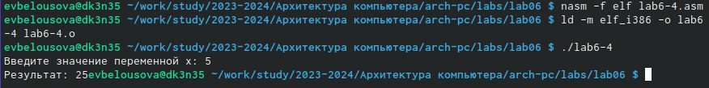                                   
Рис. 25: Запуск исполняемого файла                                
                                   

*Ответы на вопросы:*
1. За вывод сообщения “Ваш вариант” отвечают данные строки кода:
mov eax,rem
call sprint
2. Инструкция mov ecx, x используется, чтобы положить адрес вводимой стро-
ки x в регистр ecx mov edx, 80 - запись в регистр edx длины вводимой строки
call sread - вызов подпрограммы из внешнего файла, обеспечивающей ввод
сообщения с клавиатуры.
3. call atoi используется для вызова подпрограммы из внешнего файла, кото-
рая преобразует ascii-код символа в целое число и записывает результат в
регистр eax.
4. За вычисления варианта отвечают данные строки кода:
xor edx,edx ; обнуление edx для корректной работы div
mov ebx,20 ; ebx = 20
div ebx ; eax = eax/20, edx - остаток от деления
inc edx ; edx = edx + 1
5. При выполнении инструкции div ebx остаток от деления записывается в
регистр edx.
6. Инструкция inc edx увеличивает значение регистра edx на 1.
7. За вывод на экран результатов вычислений отвечают данные строки кода:
mov eax,edx
call iprintLF

**5 Выводы**

При выполнении данной лабораторной работы я освоила арифметические
инструкции языка ассемблера NASM

**6 Список литературы**

[Архитектура ЭВМ](file:///afs/.dk.sci.pfu.edu.ru/home/e/v/evbelousova/%D0%97%D0%B0%D0%B3%D1%80%D1%83%D0%B7%D0%BA%D0%B8/%D0%9B07_%D0%94%D0%B2%D0%BE%D1%80%D0%BA%D0%B8%D0%BD%D0%B0_%D0%BE%D1%82%D1%87%D0%B5%D1%82.pdf)
