---
## Front matter
title: "Отчет по лабораторной работе №7"
subtitle: "дисциплина: Архитектура компьютера"
author: "Белоусова Елизавета Валентиновна"

## Generic otions
lang: ru-RU
toc-title: "Содержание"

## Bibliography
bibliography: bib/cite.bib
csl: pandoc/csl/gost-r-7-0-5-2008-numeric.csl

## Pdf output format
toc: true # Table of contents
toc-depth: 2
lof: true # List of figures
lot: true # List of tables
fontsize: 12pt
linestretch: 1.5
papersize: a4
documentclass: scrreprt
## I18n polyglossia
polyglossia-lang:
  name: russian
  options:
	- spelling=modern
	- babelshorthands=true
polyglossia-otherlangs:
  name: english
## I18n babel
babel-lang: russian
babel-otherlangs: english
## Fonts
mainfont: PT Serif
romanfont: PT Serif
sansfont: PT Sans
monofont: PT Mono
mainfontoptions: Ligatures=TeX
romanfontoptions: Ligatures=TeX
sansfontoptions: Ligatures=TeX,Scale=MatchLowercase
monofontoptions: Scale=MatchLowercase,Scale=0.9
## Biblatex
biblatex: true
biblio-style: "gost-numeric"
biblatexoptions:
  - parentracker=true
  - backend=biber
  - hyperref=auto
  - language=auto
  - autolang=other*
  - citestyle=gost-numeric
## Pandoc-crossref LaTeX customization
figureTitle: "Рис."
tableTitle: "Таблица"
listingTitle: "Листинг"
lofTitle: "Список иллюстраций"
lotTitle: "Список таблиц"
lolTitle: "Листинги"
## Misc options
indent: true
header-includes:
  - \usepackage{indentfirst}
  - \usepackage{float} # keep figures where there are in the text
  - \floatplacement{figure}{H} # keep figures where there are in the text
---

**1 Цель работы**

Цель данной лабораторной работы - изучение команд условного и безусловного переходов, приобретение навыков написания программ с использованием переходов, знакомство с назначением и структурой файла листинга.

**2 Задание**

1. Реализация переходов в NASM
2. Изучение структуры файлы листинга
3. Выполнение заданий для самостоятельной работы

**3 Теоретическое введение**

Для реализации ветвлений в ассемблере используются так называемые команды передачи
управления или команды перехода. Можно выделить 2 типа переходов:
• условный переход – выполнение или не выполнение перехода в определенную точку
программы в зависимости от проверки условия.
• безусловный переход – выполнение передачи управления в определенную точку про-
граммы без каких-либо условий.

**4 Выполнение лабораторной работы**

Перехожу в каталог, созданный для файлов с программами для лабораторной работы №7 и, перейдя в него, создаю файл lab7-1.asm с помощью утилиты touch (рис. 1).                            
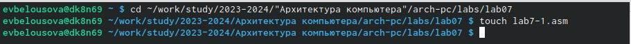                                   
Рис. 1: Создание файла                          

Открываю файл lab7-1.asm и ввожу в него текст программы из листинга 7.1, перед этим скопировав файл in_out.asm в каталог lab07 (рис. 2)                         
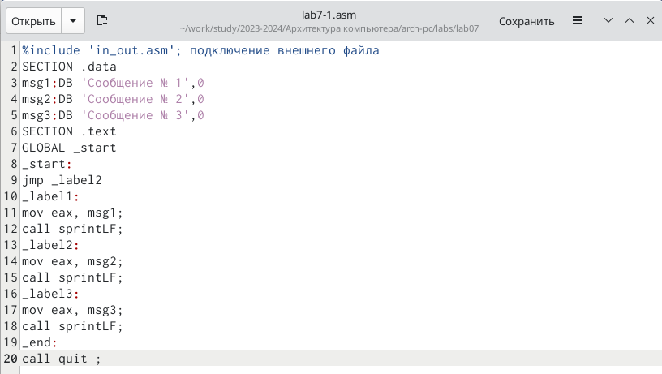                                   
Рис. 2: Редактирование файла                                  

Создаю исполняемый файл программы и запускаю его (рис 3).                            
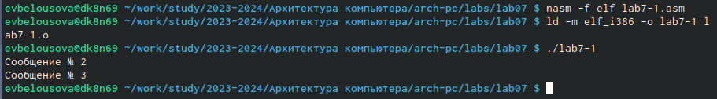                                   
Рис. 3: Запуск исполняемого файла                             

Открываю файл lab7-1.asm, изменяя текст программы так, чтобы выводила сначала "Сообщение № 2", потом "Сообщение № 1" и завершала работу. Для этого в текст программы после вывода сообщения № 2 добавляю инструкцию jmp с меткой _label1 (т.е. переход к инструкциям вывода сообщения № 1) и после вывода сообщения № 1 добавлю инструкцию jmp с меткой _end (т.е. переход к инструкции call quit).(рис. 4).                          
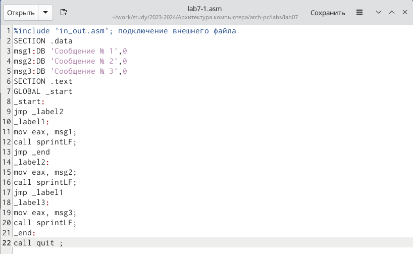                                   
Рис. 4: Редактирование файла                                       

Создаю исполняемый файл программы и запускаю его (рис. 5).             
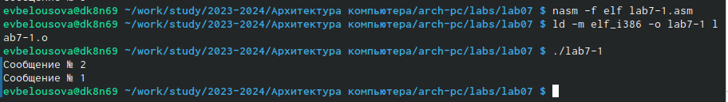                                   
Рис. 5: Запуск исполняемого файла                                                 

Снова открываю файл и редактирую текст программы таким образом, чтобы сначала выводилось "Сообщение № 3", затем "Сообщение № 2", "Сообщение № 1" и программа завершала работу (рис. 6).                         
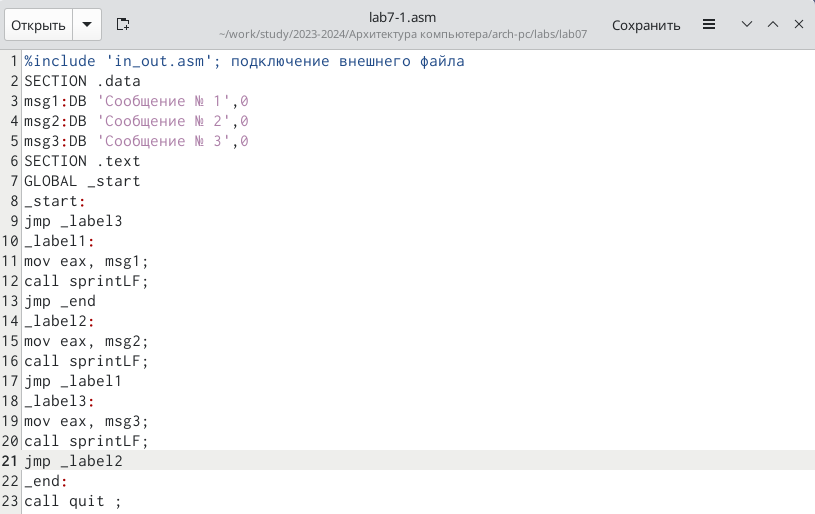                                   
Рис. 6: Редактирование файла                    

Создаю исполняемый файл программы и запускаю его (рис. 7).             
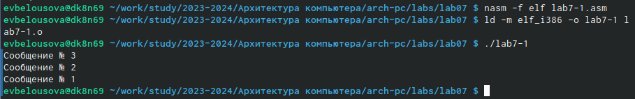                                   
Рис. 7: Запуск исполняемого файла  

Создаю новый файл lab7-2.asm с помощью утилиты touch (рис. 8).                    
                                   
Рис. 8: Создание файла                              

Ввожу в файл текст другой программы, которая определяет и выводит на экран наибольшую из 3 целочисленных переменных:A,B и C (рис. 9).                    
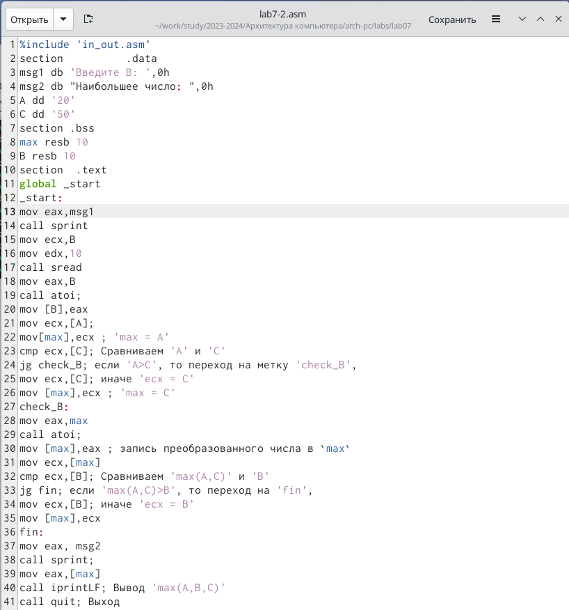                                        
Рис. 9: Редактирование файла                        

Создаю и запускаю исполняемый файл lab7-2 и проверяю корректность работы программы при разных значениях B (рис. 10).                   
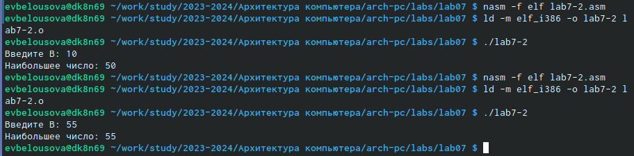                                   
Рис. 10: Запуск исполняемого файла                              

Создаю файл листинга программы из файла lab7-2.asm командой nasm -f elf -l lab7-2.lst lab7-2.asm (рис. 11).                          
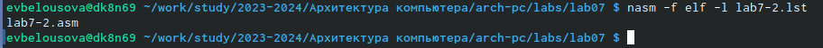                                        
Рис. 11: Создание файла                          

Открываю файл листинга lab7-2.lst с помощью текстового редактора gedit (рис. 12). Внимательно ознакамливаюсь с форматом и содержимым файла. Рассмотрим некоторые строки листинга и попробуем обьяснить их. Я возьму строки 14-16. 14-16 - это номера строк файла листинга, которые могут не соответствовать  номеру строки в файле с исходным текстом программы. Далее "0000000B 29D8", "0000000D 5B " и "0000000E C3 " в каждой из строк 14-16 соответственно обозначают адрес и машинный код, а все, что стоит в этих строках дальше после  <1> содержит исходный текст программы, т.е. исходную программу вместе с комментариями.                               
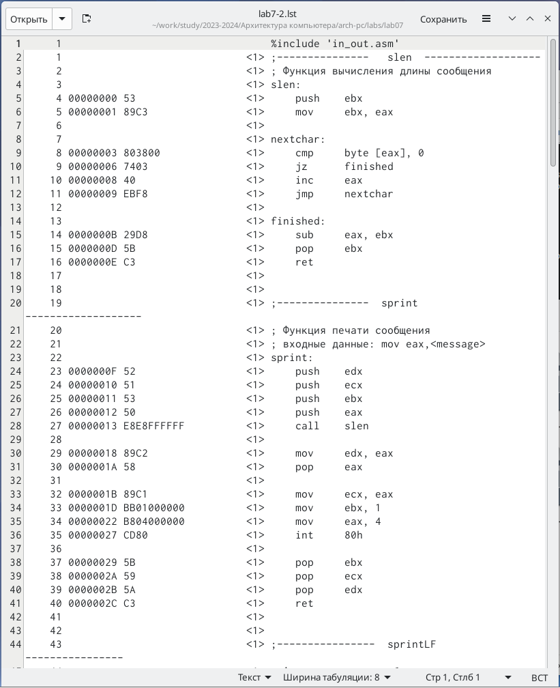                                   
Рис. 12: Файл листинга                           

Открываю файл с программой lab7-2.asm и в одной из инструкций с двумя операндами удаляю один операнд (рис. 13)                         
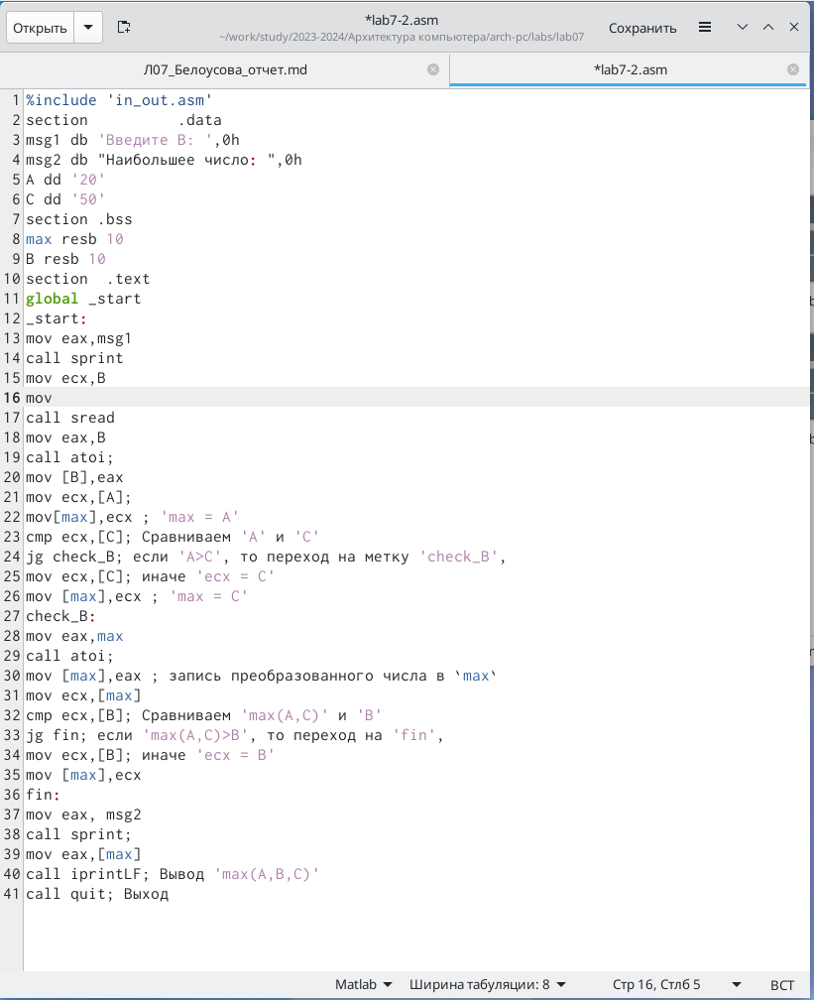                                   
Рис. 13: Редактирование файла                        

Выполняю трансляцию с получением файла листинга и вижу, что система выдает ошибку (рис. 14)                     
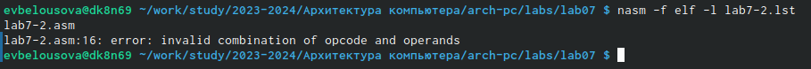                                   
Рис. 14: Запуск исполняемого файла                     

Для выполнения заданий для самостоятельной работы создаю файл lab07-3.asm с помощью утилиты touch (рис. 15)                        
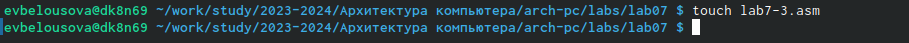                                   
Рис. 15: Создание файла                              

Пишу программу нахождения наименьшей из 3 целочисленных переменных a,b и c. Значения переменных беру из таблицы 7.5 в соответствии со своим вариантом (18) (рис. 16)              
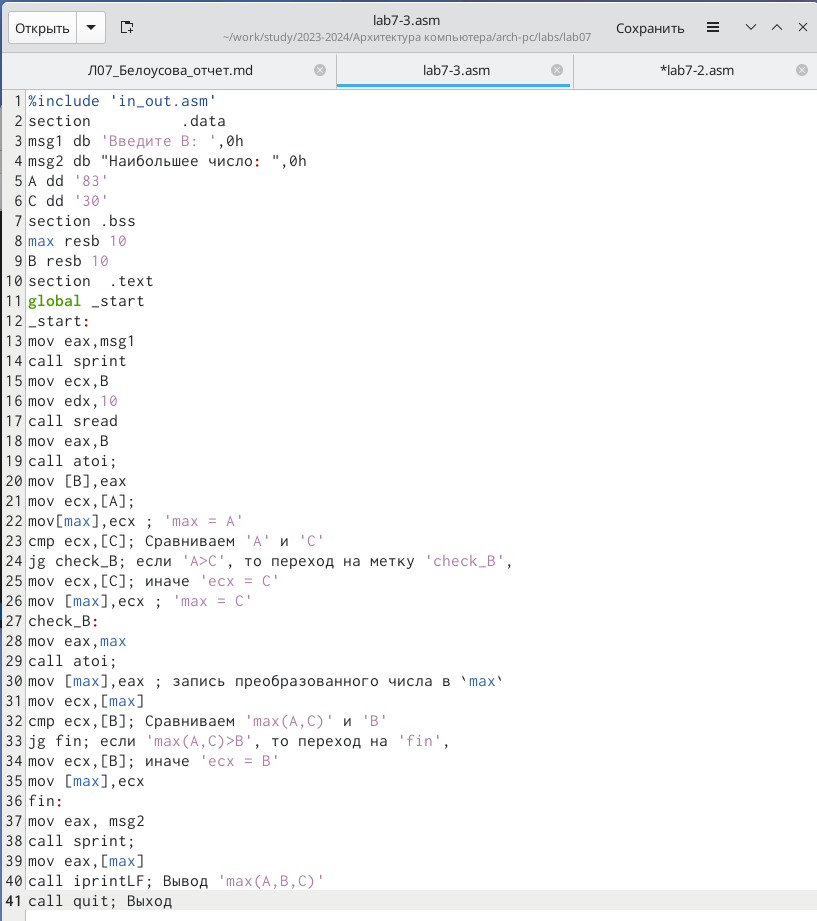                                   
Рис. 16: Написание программы                 

Создаю исполняемый файл и проверяю работу программы. (рис. 17) Программа работает корректно.              
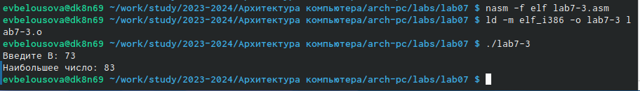                                   
Рис. 17: Запуск исполняемого файла                           

**5 Выводы**

При выполнении данной лабораторной работы я изучила команды условного и безусловного переходов, приобрела навыки написания программ с использованием переходов, познакомилась с назначением и структурой файла листинга.

**6 Список литературы**

[Архитектура ЭВМ](https://esystem.rudn.ru/pluginfile.php/2089087/mod_resource/content/0/%D0%9B%D0%B0%D0%B1%D0%BE%D1%80%D0%B0%D1%82%D0%BE%D1%80%D0%BD%D0%B0%D1%8F%20%D1%80%D0%B0%D0%B1%D0%BE%D1%82%D0%B0%20%E2%84%967.%20%D0%9A%D0%BE%D0%BC%D0%B0%D0%BD%D0%B4%D1%8B%20%D0%B1%D0%B5%D0%B7%D1%83%D1%81%D0%BB%D0%BE%D0%B2%D0%BD%D0%BE%D0%B3%D0%BE%20%D0%B8%20%D1%83%D1%81%D0%BB%D0%BE%D0%B2%D0%BD%D0%BE%D0%B3%D0%BE%20%D0%BF%D0%B5%D1%80%D0%B5%D1%85%D0%BE%D0%B4%D0%BE%D0%B2%20%D0%B2%20Nasm.%20%D0%9F%D1%80%D0%BE%D0%B3%D1%80%D0%B0%D0%BC%D0%BC%D0%B8%D1%80%D0%BE%D0%B2%D0%B0%D0%BD%D0%B8%D0%B5%20%D0%B2%D0%B5%D1%82%D0%B2%D0%BB%D0%B5%D0%BD%D0%B8%D0%B9..pdf)
