---
## Front matter
title: "Отчет по лабораторной работе №8"
subtitle: "дисциплина: Архитектура компьютера"
author: "Белоусова Елизавета Валентиновна"

## Generic otions
lang: ru-RU
toc-title: "Содержание"

## Bibliography
bibliography: bib/cite.bib
csl: pandoc/csl/gost-r-7-0-5-2008-numeric.csl

## Pdf output format
toc: true # Table of contents
toc-depth: 2
lof: true # List of figures
lot: true # List of tables
fontsize: 12pt
linestretch: 1.5
papersize: a4
documentclass: scrreprt
## I18n polyglossia
polyglossia-lang:
  name: russian
  options:
	- spelling=modern
	- babelshorthands=true
polyglossia-otherlangs:
  name: english
## I18n babel
babel-lang: russian
babel-otherlangs: english
## Fonts
mainfont: PT Serif
romanfont: PT Serif
sansfont: PT Sans
monofont: PT Mono
mainfontoptions: Ligatures=TeX
romanfontoptions: Ligatures=TeX
sansfontoptions: Ligatures=TeX,Scale=MatchLowercase
monofontoptions: Scale=MatchLowercase,Scale=0.9
## Biblatex
biblatex: true
biblio-style: "gost-numeric"
biblatexoptions:
  - parentracker=true
  - backend=biber
  - hyperref=auto
  - language=auto
  - autolang=other*
  - citestyle=gost-numeric
## Pandoc-crossref LaTeX customization
figureTitle: "Рис."
tableTitle: "Таблица"
listingTitle: "Листинг"
lofTitle: "Список иллюстраций"
lotTitle: "Список таблиц"
lolTitle: "Листинги"
## Misc options
indent: true
header-includes:
  - \usepackage{indentfirst}
  - \usepackage{float} # keep figures where there are in the text
  - \floatplacement{figure}{H} # keep figures where there are in the text
---

**1 Цель работы**

Цель данной лабораторной работы - приобретение практического опыта в
написании программ с использованием циклов и обработкой аргументов ко-
мандной строки.

**2 Задание**

1. Реализация циклов в NASM.
2. Обработка аргументов командной строки.
3. Выполнение заданий для самостоятельной работы

**3 Теоретическое введение**

Стек — это структура данных, организованная по принципу LIFO («Last In
— First Out» или «последним пришёл — первым ушёл»). Стек является частью
архитектуры процессора и реализован на аппаратном уровне. Для работы со
стеком в процессоре есть специальные регистры (ss, bp, sp) и команды. Основ-
ной функцией стека является функция сохранения адресов возврата и передачи
аргументов при вызове процедур. Кроме того, в нём выделяется память для
локальных переменных и могут временно храниться значения регистров. Стек
имеет вершину, адрес последнего добавленного элемента, который хранится в
регистре esp (указатель стека). Противоположный конец стека называется дном.
Значение, помещённое в стек последним, извлекается первым. При помещении
значения в стек указатель стека уменьшается, а при извлечении — увеличивается.
Для стека существует две основные операции:
• добавление элемента в вершину стека (push);
• извлечение элемента из вершины стека (pop).
Команда push размещает значение в стеке, т.е. помещает значение в ячейку
памяти, на которую указывает регистр esp, после этого значение регистра esp
увеличивается на 4. Данная команда имеет один операнд — значение, которое
необходимо поместить в стек. Существует ещё две команды для добавления
значений в стек. Это команда pusha, которая помещает в стек содержимое всех
регистров общего назначения в следующем порядке: ах, сх, dx, bх, sp, bp, si, di.
А также команда pushf, которая служит для перемещения в стек содержимого
регистра флагов. Обе эти команды не имеют операндов. Команда pop извлекает
значение из стека, т.е. извлекает значение из ячейки памяти, на которую ука-
зывает регистр esp, после этого уменьшает значение регистра esp на 4. У этой
команды также один операнд, который может быть регистром или переменной
в памяти. Нужно помнить, что извлечённый из стека элемент не стирается из
памяти и остаётся как “мусор”, который будет перезаписан при записи нового
значения в стек. Для организации циклов существуют специальные инструкции.
Для всех инструкций максимальное количество проходов задаётся в регистре
ecx. Наиболее простой является инструкция loop. Она позволяет организовать
безусловный цикл. Иструкция loop выполняется в два этапа. Сначала из регистра
ecx вычитается единица и его значение сравнивается с нулём. Если регистр не
равен нулю, то выполняется переход к указанной метке. Иначе переход не выпол-
няется и управление передаётся команде, которая следует сразу после команды
loop.

**4 Выполнение лабораторной работы**

*1) Реализация циклов в NASM*
Перехожу в каталог, созданный для файлов с программами для лабораторной работы №8. С помощью touch создаю файл lab8-1.asm. Копирую в текущий каталог файл in_out.asm, так как он будет использоваться в
дальнейшем (рис. 1).                            
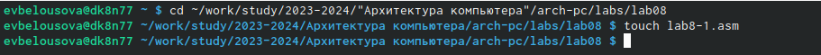                                   
Рис. 1: Перемещение между директориями, создание файла                          

Открываю созданный файл lab8-1.asm, вставляю в него програм-
му из листинга 8.1  (рис. 2)                         
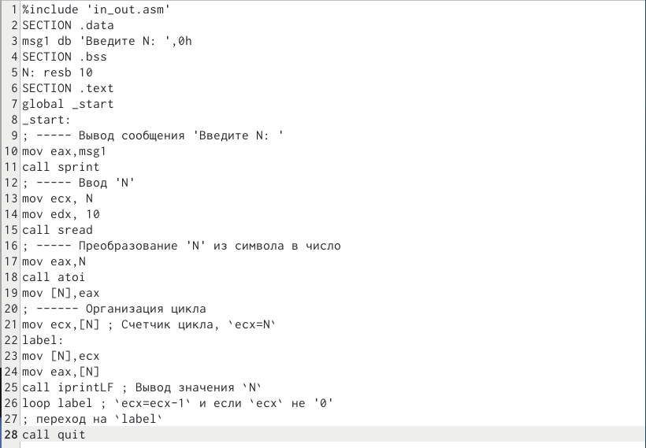                                   
Рис. 2: Редактирование файла                                   

Создаю исполняемый файл и запускаю его (рис. 3).Мы видим, что использование
инструкции loop позволяет выводить значения регистра ecx циклично.                              
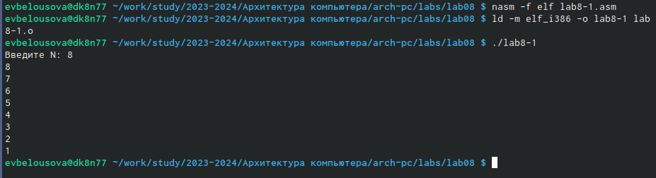                                   
Рис. 3: Запуск исполняемого файла                              

Изменяю значение ecx в цикле (рис. 4).                          
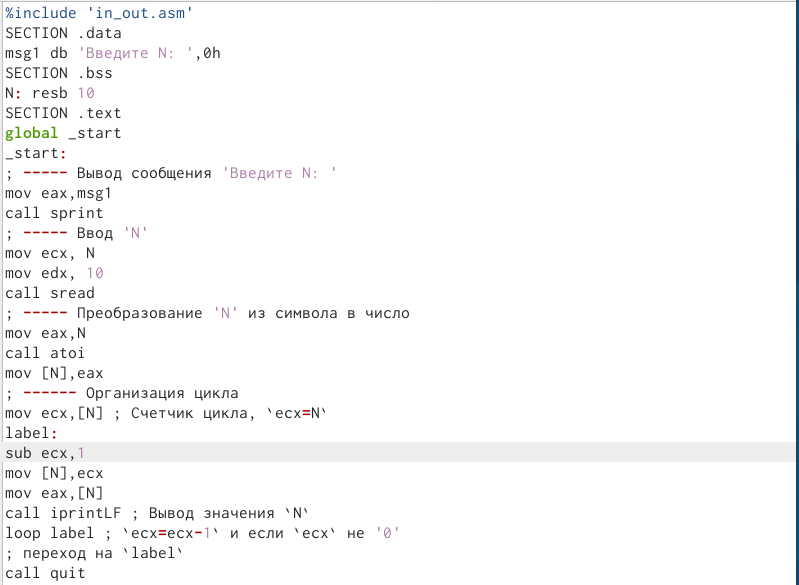                                   
Рис. 4: Редактирование файла                                       

Создаю новый исполняемый файл и запускаю его. Видим, что регистр ecx в цикле принимает разные значения, а число проходов цикла не соответствует значению N (рис. 5).                         
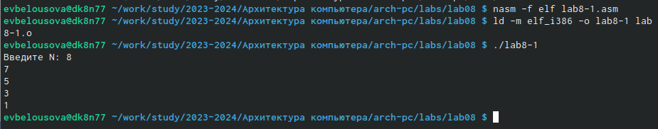                                   
Рис. 5: Запуск исполняемого файла                             

Вношу изменения в текст программы, добавив команды push, pop для сохране-
ния значения счётчика цикла loop (рис. 6).                       
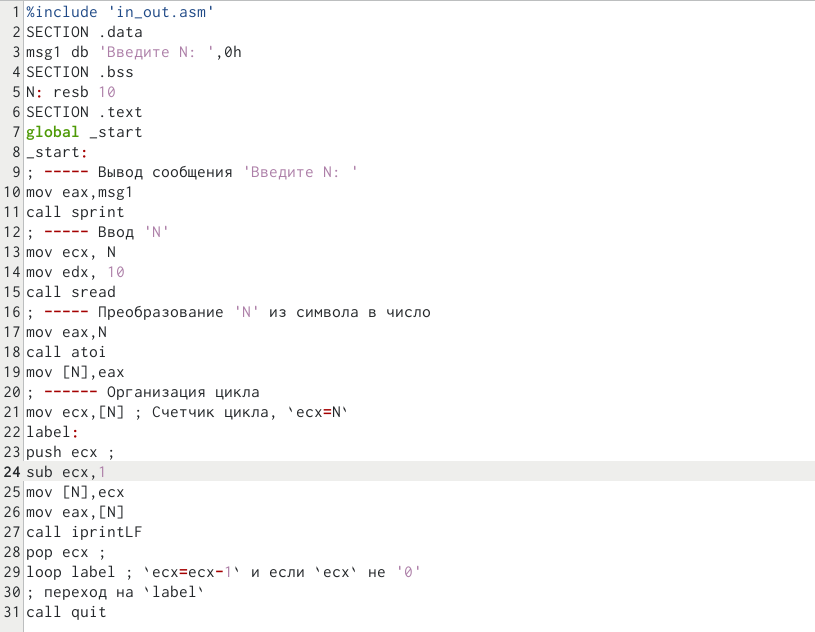                                   
Рис. 6: Редактирование файла                          

Выполняю компиляцию и компоновку, и запускаю исполняемый файл. В дан-
ном случае число проходов цикла соответствует значению N, введенному с кла-
виатуры. Счёт идёт, не от 8-ми, а от 7-ми, но включается 0  (рис. 7)                            
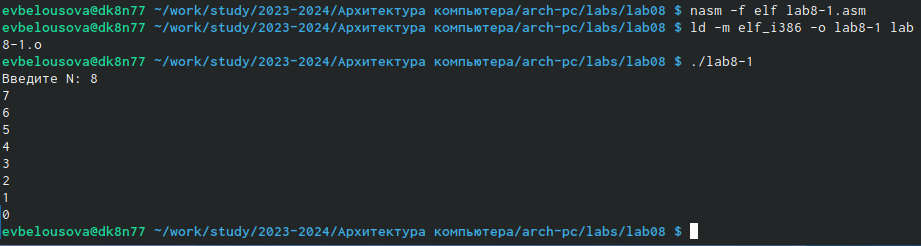                                   
Рис. 7: Запуск исполняемого файла                   

*2) Обработка аргументов командной строки*

Создаю файл  lab8-2.asm (рис. 8).                    
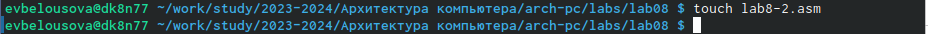                                   
Рис. 8: Создание файла                              

Редактирую его, вводя программу из листинга 8.2 (рис. 9).                             
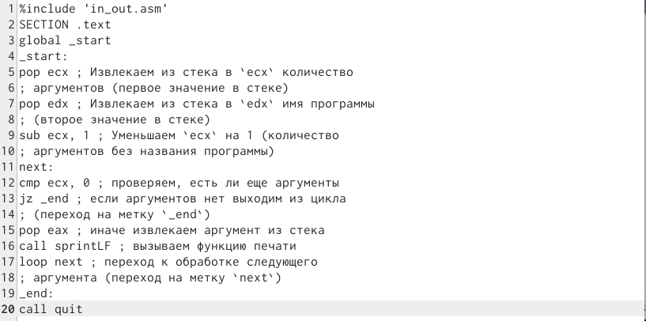                                        
Рис. 9: Редактирование файла                        

Создаю исполняемый файл и запускаю его. Вижу, что программа обработала 3 аргумента, указанные мною при запуске (рис. 10)                    
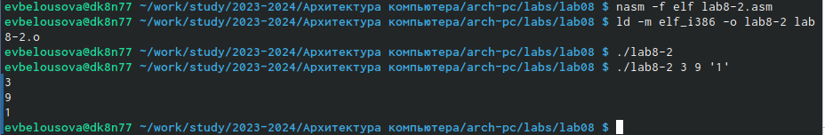                                   
Рис. 10: Запуск исполняемого файла                              

Создаю файл lab8-3.asm (рис. 11).                          
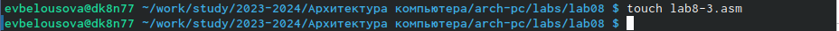                                        
Рис. 11: Создание файла                          

Ввожу в него программу из листинга 8.3 (рис. 12)                               
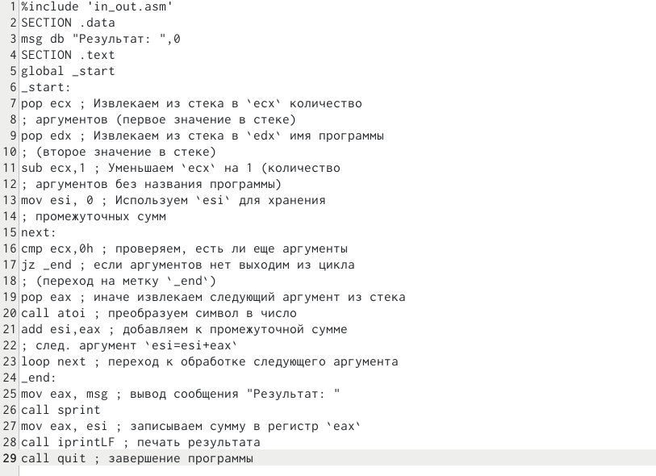                                   
Рис. 12:Редактирование файла                            

Создаю исполняемый файл и запускаю его (рис. 13)                    
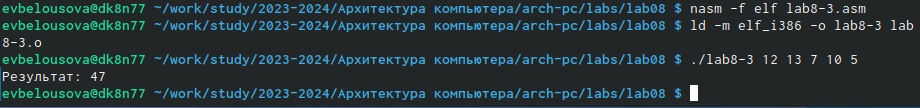                                        
Рис. 13:Запуск исполняемого файла                              

Изменяю текст программы для вычисления произведения аргументов команд-
ной строки (рис. 14)                              
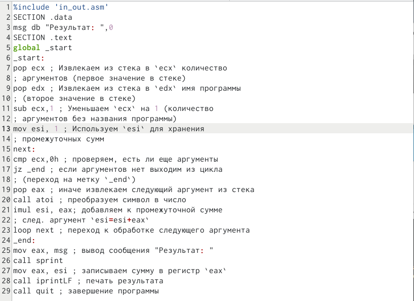                                   
Рис. 14: Редактирование файла                            
                  
Запускаю исполняемый файл, вижу, что выводится верное значение, программа работает корректно (рис. 15)                                  
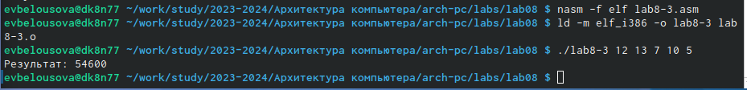                                   
Рис. 15: Запуск исполняемого файла                          

*3) Выполнение заданий для самостоятельной работы*

Создаю файл  lab8-4.asm с помощью утилиты touch (рис. 16).                        
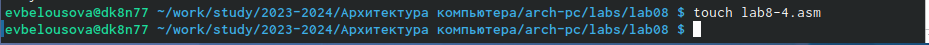                                        
Рис. 16: Создание файла                   

Открываю созданный файл для редактирования, ввожу в него текст программы для суммирования значений функции, предложенной в варианте 18, полученным мною при выполнении лабораторной работы №7  (рис. 17)                     
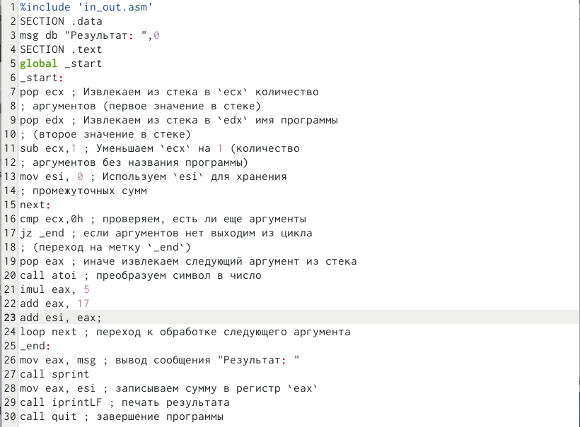                                   
Рис. 17: Редактирование файла                             

Запускаю исполняемый файл, выполняю проверку и понимаю, что написанная мной программа работает верно (рис. 18).                       
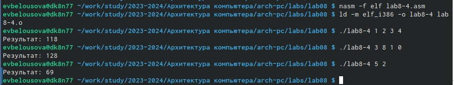                                   
Рис. 18: Запуск исполняемого файла                        

Листинг 4.1 - Программа для суммирования нескольких значений функции,
предложенной в варианте 18.

%include 'in_out.asm'                            
SECTION .data                                    
msg db "Результат: ",0                                          
SECTION .text                                      
global _start                                              
_start:                                     
pop ecx ; Извлекаем из стека в `ecx` количество                         
; аргументов (первое значение в стеке)                                 
pop edx ; Извлекаем из стека в `edx` имя программы                     
; (второе значение в стеке)                        
sub ecx,1 ; Уменьшаем `ecx` на 1 (количество                         
; аргументов без названия программы)                              
mov esi, 0 ; Используем `esi` для хранения                            
; промежуточных сумм                            
next:                              
cmp ecx,0h ; проверяем, есть ли еще аргументы                          
jz _end ; если аргументов нет выходим из цикла                                
; (переход на метку `_end`)                            
pop eax ; иначе извлекаем следующий аргумент из стека                                
call atoi ; преобразуем символ в число                     
imul eax, 5                                      
add eax, 17                                         
add esi, eax;                                     
loop next ; переход к обработке следующего аргумента                    
_end:                                  
mov eax, msg ; вывод сообщения "Результат: "                             
call sprint                                 
mov eax, esi ; записываем сумму в регистр `eax`                             
call iprintLF ; печать результата                       
call quit ; завершение программы                                

**5 Выводы**

При выполнении данной лабораторной работы я приобрела практический
опыт в написании программ с использованием циклов и обработкой аргументов
командной строки.

**6 Список литературы**

[Архитектура ЭВМ](https://esystem.rudn.ru/pluginfile.php/2089095/mod_resource/content/0/%D0%9B%D0%B0%D0%B1%D0%BE%D1%80%D0%B0%D1%82%D0%BE%D1%80%D0%BD%D0%B0%D1%8F%20%D1%80%D0%B0%D0%B1%D0%BE%D1%82%D0%B0%20%E2%84%968.%20%D0%9F%D1%80%D0%BE%D0%B3%D1%80%D0%B0%D0%BC%D0%BC%D0%B8%D1%80%D0%BE%D0%B2%D0%B0%D0%BD%D0%B8%D0%B5%20%D1%86%D0%B8%D0%BA%D0%BB%D0%B0.%20%D0%9E%D0%B1%D1%80%D0%B0%D0%B1%D0%BE%D1%82%D0%BA%D0%B0%20%D0%B0%D1%80%D0%B3%D1%83%D0%BC%D0%B5%D0%BD%D1%82%D0%BE%D0%B2%20%D0%BA%D0%BE%D0%BC%D0%B0%D0%BD%D0%B4%D0%BD%D0%BE%D0%B9%20%D1%81%D1%82%D1%80%D0%BE%D0%BA%D0%B8..pdf)
