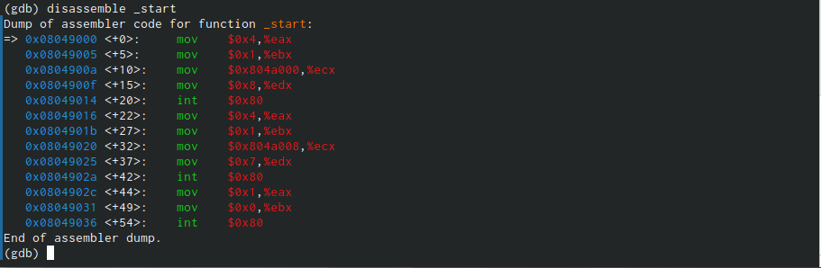
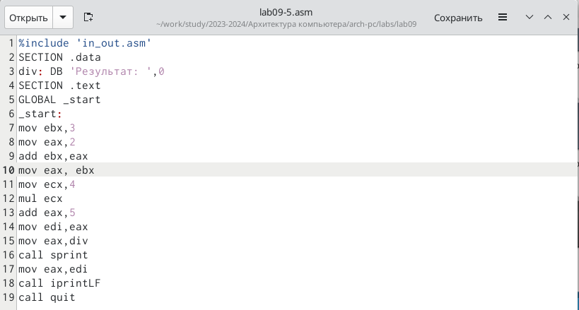

---
## Front matter
title: "Отчет по лабораторной работе №9"
subtitle: "дисциплина: Архитектура компьютера"
author: "Белоусова Елизавета Валентиновна"

## Generic otions
lang: ru-RU
toc-title: "Содержание"

## Bibliography
bibliography: bib/cite.bib
csl: pandoc/csl/gost-r-7-0-5-2008-numeric.csl

## Pdf output format
toc: true # Table of contents
toc-depth: 2
lof: true # List of figures
lot: true # List of tables
fontsize: 12pt
linestretch: 1.5
papersize: a4
documentclass: scrreprt
## I18n polyglossia
polyglossia-lang:
  name: russian
  options:
	- spelling=modern
	- babelshorthands=true
polyglossia-otherlangs:
  name: english
## I18n babel
babel-lang: russian
babel-otherlangs: english
## Fonts
mainfont: PT Serif
romanfont: PT Serif
sansfont: PT Sans
monofont: PT Mono
mainfontoptions: Ligatures=TeX
romanfontoptions: Ligatures=TeX
sansfontoptions: Ligatures=TeX,Scale=MatchLowercase
monofontoptions: Scale=MatchLowercase,Scale=0.9
## Biblatex
biblatex: true
biblio-style: "gost-numeric"
biblatexoptions:
  - parentracker=true
  - backend=biber
  - hyperref=auto
  - language=auto
  - autolang=other*
  - citestyle=gost-numeric
## Pandoc-crossref LaTeX customization
figureTitle: "Рис."
tableTitle: "Таблица"
listingTitle: "Листинг"
lofTitle: "Список иллюстраций"
lotTitle: "Список таблиц"
lolTitle: "Листинги"
## Misc options
indent: true
header-includes:
  - \usepackage{indentfirst}
  - \usepackage{float} # keep figures where there are in the text
  - \floatplacement{figure}{H} # keep figures where there are in the text
---

**1 Цель работы**

Цель данной лабораторной работы - это приобретение практического опыта
в написании программ с использованием подпрограмм, а также знакомство с
методами отладки при помощи gdb и его основными возможностями.

**2 Задание**

1. Реализация подпрограмм в NASM.
2. Отладка программ при помощи gdb.
3. Выполнение заданий для самостоятельной работы

**3 Теоретическое введение**

Отладка — это процесс поиска и исправления ошибок в программе. В общем
случае егоможно разделить на четыре этапа:
• обнаружение ошибки;
• поиск её местонахождения;
• определение причины ошибки;
• исправление ошибки.
Можно выделить следующие типы ошибок:
• синтаксические ошибки — обнаруживаются во время трансляции исходного
кода и вызваны нарушением ожидаемой формы или структуры языка;
• семантические ошибки — являются логическими и приводят к тому, что
программа запускается, отрабатывает, но не даёт желаемого результата;
• ошибки в процессе выполнения — не обнаруживаются при трансляции и вы-
зывают прерывание выполнения программы (например, это ошибки, связанные
с переполнением или делением на ноль).
Второй этап — поиск местонахождения ошибки. Некоторые ошибки обнару-
жить довольно трудно. Лучший способ найти место в программе, где находится
ошибка, это разбить программу на части и произвести их отладку отдельно друг
от друга.
Третий этап — выяснение причины ошибки. После определения местонахож-
дения ошибки обычно проще определить причину неправильной работы про-
граммы.
Последний этап — исправление ошибки. После этого при повторном запуске программы,
может обнаружиться следующая ошибка, и процесс отладки начнётся заново.
Наиболее часто применяют следующие методы отладки:
• создание точек контроля значений на входе и выходе участка программы (например,
вывод промежуточных значений на экран — так называемые диагностические сообще-
ния);
• использование специальных программ-отладчиков.
Отладчики позволяют управлять ходом выполнения программы, контролировать и из-
менять данные. Это помогает быстрее найти место ошибки в программе и ускорить её
исправление. Наиболее популярные способы работы с отладчиком — это использование
точек останова и выполнение программы по шагам.
Пошаговое выполнение — это выполнение программы с остановкой после каждой строчки,
чтобы программист мог проверить значения переменных и выполнить другие действия.
Точки останова — это специально отмеченные места в программе, в которых программа-
отладчик приостанавливает выполнение программы и ждёт команд. Наиболее популярные
виды точек останова:
• Breakpoint — точка останова (остановка происходит, когда выполнение доходит до
определённой строки, адреса или процедуры, отмеченной программистом);
• Watchpoint — точка просмотра (выполнение программы приостанавливается, если
программа обратилась к определённой переменной: либо считала её значение, либо
изменила его).
Точки останова устанавливаются в отладчике на время сеанса работы с кодом програм-
мы, т.е. они сохраняются до выхода из программы-отладчика или до смены отлаживаемой
программы.
GDB (GNU Debugger — отладчик проекта GNU) [1] работает на многих UNIX-подобных
системах и умеет производить отладку многих языков программирования. GDB предлагает
обширные средства для слежения и контроля за выполнением компьютерных программ. От-
ладчик не содержит собственного графического пользовательского интерфейса и использует
стандартный текстовый интерфейс консоли. Однако для GDB существует несколько сторон-
них графических надстроек, а кроме того, некоторые интегрированные среды разработки
используют его в качестве базовой подсистемы отладки.
Отладчик GDB (как и любой другой отладчик) позволяет увидеть, что происходит «внутри»
программы в момент её выполнения или что делает программа в момент сбоя.
GDB может выполнять следующие действия:
• начать выполнение программы, задав всё, что может повлиять на её поведение;
• остановить программу при указанных условиях;
• исследовать, что случилось, когда программа остановилась;
• изменить программу так, чтобы можно было поэкспериментировать с устранением
эффектов одной ошибки и продолжить выявление других.

**4 Выполнение лабораторной работы**

1) Реализация подпрограмм в NASM 
Перехожу в каталог, созданный для файлов с программами для лабораторной работы №9. С помощью touch создаю файл lab09-1.asm. Копирую в текущий каталог файл in_out.asm, так как он будет использоваться в
дальнейшем (рис. 1).                            
                                   
Рис. 1: Перемещение между директориями, создание файла                          

Открываю созданный файл lab09-1.asm, вставляю в него програм-
му из листинга 9.1  (рис. 2)                         
                                   
Рис. 2: Редактирование файла                                   

Создаю исполняемый файл и запускаю его (рис. 3).                             
                                   
Рис. 3: Запуск исполняемого файла                              

Добавляю подпрограмму subcalcul_, чтобы программа вычисляла значение
f(g(x)) (рис. 4).                          
                                   
Рис. 4: Редактирование файла                                       

Создаю исполняемый файл и убеждаюсь в правильности его работы (рис. 5).                         
                                   
Рис. 5: Запуск исполняемого файла 

2) Отладка программ при помощи gdb                             

Создаю файл lab09-2.asm с помощью утилиты touch (рис. 6).                       
                                   
Рис. 6: Создание файла                          

Открываю созданный файл и вношу в него текст программы из листинга 9.2 (рис. 7)                            
                                   
Рис. 7: Редактирование файла                   

Создаю исполняемый файл (рис. 8).                    
                                   
Рис. 8: Запуск исполняемого файла                              

Загружаю файл в отладчик gdb (рис. 9).                             
                                        
Рис. 9: Отладчик                         

Запускаю программу с помощью команды run и убеждаюсь в корректности работы программы (рис. 10)                    
                                   
Рис. 10: Запуск программы                              

Устанавливаю метку _start и запускаю програаму. Вижу работу метки (рис. 11).                          
                                        
Рис. 11: Установка и работа метки                          

Смотрю дисассимилированный код программы с помощью команды disassemble
начиная с метки _start (рис. 12)                               
                                   
Рис. 12:Дисассимилированный код                            

Переключаюсь на отображение команд с Intel’овским синтаксисом, введя команду set
disassembly-flavor intel (рис. 13). Различия отображения синтаксиса машинных команд в режимах ATT и  Intel: в синтаксисе ATT перед именем регистра ставится префикс %, адрес инструкции пишется перед именем регистра (в Intel - наоборот), перед ним ставится префикс $.                
                                        
Рис. 13:Дисассимилированный код программы с синтаксисом intel                              

Включаю режим псевдографики (рис. 14) и (рис. 15)                      
                                   
Рис. 14: Режим псевдографики                            
                  
                                   
Рис. 15: Режим псевдографики                          

Проверяю точки останова (рис. 16).                        
                                        
Рис. 16: Проверка точек останова                   

Устанавливаю точку останова в последней инструкции (рис. 17)                     
                                   
Рис. 17: Установка точки останова                             

Смотрю информацию обо всех установленных точках останова (рис. 18).                       
                                   
Рис. 18: Точки останова                         

Выполняю 5 инструкций stepi, и последовательно замечанию изменение значений
регистров на экране соответственно (рис. 19)                        
                                   
Рис. 19: Изменение значений регистров                                        

Просматриваю содержимое регистров с помощью команды info registers (рис. 20) и (рис. 21)                    
                                   
Рис. 20: Просмотр содержимого регистров                              
                           
                                        
Рис. 21:Просмотр содержимого регистров                             

Смотрю значение переменной msg1 по имени с помощью команды x &<имя переменной> (рис. 22)                      
                                   
Рис. 22: Значение переменной msg1                                  

Смотрю значение переменной msg2 по адресу (рис. 23).                 
                                   
Рис. 23:Значение переменной msg2                                  

Изменяю первый символ переменной msg1 с помощью команды set (рис. 24)                           
                                   
Рис. 24: Изменение переменной msg1                       

Аналогичные действия проделываю с переменной msg2 (рис. 25)                   
                                   
Рис. 25: Изменение переменной msg2

Вывожу в различных форматах (в шестнадцатеричном формате, в двоичном формате и
в символьном виде) значение регистра edx (рис. 26)                              
                                   
Рис. 26: Значения регистра edx                     

Изменяю значение регистра ebx с помощью команды set (рис. 27)                              
                                   
Рис. 27: Изменение значений регистра                            

Разницу в выводе команд можно объяснить так: при бескавычном значении 2, мы получаем это же значение, а в другом случае переменная воспринимается иначе 
и на выходе мы видим значение 50.
                                   
Завершаю выполнение программы с помощью continue и выхожу из gdb с по-
мощью quit.

Копирую файл lab8-2.asm, полученный во время выполнения лабораторной
работы No8, содержащий программу для вывода аргументов командной строки.
Затем создаю исполняемый файл (рис. 28)                       
                                   
Рис. 28: Копирование файла, создание исполняемого файла                            

Загружаю исполняемый файл в отладчик, указав нужные аргументы (рис. 29)                       
                                   
Рис. 29: Загрузка файла в отладчик                          

                    
Устанавливаю точку останова перед первой инструкцией и запускаю програм-
му (рис. 30)                       
                                   
Рис. 30:  Установка точки останова, запуск программы                          

Далее просматриваю позиции стека (рис. 31)                       
                                   
Рис. 31: Просмотр позиций стека                      

Шаг изменения равен 4, т.к. каждый следующий адрес на стеке находится на
расстоянии в 4 байта от предыдущего.                       

3) Выполнение заданий для самостоятельной работы               

Копирую файл задания для самостоятельной работы. (рис. 32)                       
                                   
Рис. 32: Копирование файла                      

Реализую вычисление значения функции через подпрограмму (рис. 33)                       
                                   
Рис. 33: Копирование файла                      

Создаю исполняемый файл и убеждаюсь в правильности работы программы (рис. 34)                       
                                   
Рис. 34: Запуск исполняемого файла                      

Создаю файл lab09-5.asm (рис. 35)                       
                                   
Рис. 35: Создание файла                        

Вношу в него программу из последнего листинга (рис. 36)                       
                                   
Рис. 36: Редактирование файла                        

Создаю исполняемый файл и запускаю его. Вижу, что программа работает неверно и выдает неправильный ответ (правильный ответ:25) (рис. 37)                       
                                   
Рис. 37: Запуск исполняемого файла                        

Анализирую изменения значений регистров, чтобы выяснить, в чем заключа-
ется ошибка (рис. 38)                       
                                   
Рис. 38: Выявление ошибки                         

Нахожу ошибку и исправляю ее в тексте программы (рис. 39)                       
                                   
Рис. 39: Редактирование файла                                

Создаю исполняемый файл и запускаю его, вижу правильный ответ, программа написана верно (рис. 40)                       
                                   
Рис. 40: Редактирование файла                                
                   

Листинг 4.1 - Преобразованная программа из лабораторной работы №8.               
%include 'in_out.asm'                                          
SECTION .data                                            
msg db "Результат: ",0                                   
a: db 'f(x) = 17+5x',0                                         
SECTION .text                                            
global _start                                            
_start:                                          
mov eax, a                                         
call sprintLF                                    
pop ecx ; Извлекаем из стека в `ecx` количество                                
; аргументов (первое значение в стеке)                                        
pop edx ; Извлекаем из стека в `edx` имя программы                              
; (второе значение в стеке)                            
sub ecx,1 ; Уменьшаем `ecx` на 1 (количество                        
; аргументов без названия программы)                             
mov esi, 0 ; Используем `esi` для хранения                         
; промежуточных сумм                         
next:                          
cmp ecx,0h ; проверяем, есть ли еще аргументы                         
jz _end ; если аргументов нет выходим из цикла                             
; (переход на метку `_end`)                         
pop eax ; иначе извлекаем следующий аргумент из стека                           
call atoi ; преобразуем символ в число                                       
call _calc                                        
add esi,eax ; добавляем к промежуточной сумме                                
loop next ; переход к обработке следующего аргумента                             
_end:                                    
mov eax, msg ; вывод сообщения "Результат: "                             
call sprint                                  
mov eax, esi ; записываем сумму в регистр `eax`                         
call iprintLF ; печать результата                        
call quit ; завершение программы                                     
_calc:                            
imul eax,5                                     
add eax,17                                   
ret                                    

Листинг 4.2 - Исправленная программа для вычисления значения выражения            
%include 'in_out.asm'                         
SECTION .data                               
div: DB 'Результат: ',0                               
SECTION .text                                
GLOBAL _start                          
_start:                            
mov ebx,3                          
mov eax,2                            
add ebx,eax                               
mov eax, ebx                          
mov ecx,4                       
mul ecx                            
add eax,5                                
mov edi,eax                               
mov eax,div                               
call sprint                               
mov eax,edi                                  
call iprintLF                                
call quit                                      

**5 Выводы**

При выполнении данной лабораторной работы, я приобрела практический
опыт в написании программ с использованием подпрограмм, а также ознакоми-
лась с методами отладки при помощи gdb и его основными возможностями.

**6 Список литературы**

[Архитектура ЭВМ](file:///afs/.dk.sci.pfu.edu.ru/home/e/v/evbelousova/%D0%97%D0%B0%D0%B3%D1%80%D1%83%D0%B7%D0%BA%D0%B8/%D0%9B07_%D0%94%D0%B2%D0%BE%D1%80%D0%BA%D0%B8%D0%BD%D0%B0_%D0%BE%D1%82%D1%87%D0%B5%D1%82.pdf)
